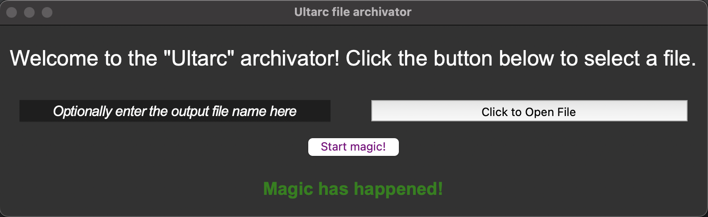
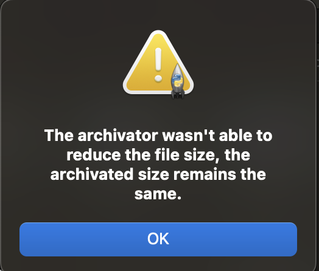

# Haffman-RLE-Archivator

## General Information
The "Ultarc" archivator archivates and unarchivates files using the Huffman and RLE algorithms.
It uses the ".ultarc" file extension for archivation.
The signature of ".ultarc" files is ACEARC.

## Usage
In order to use the archivator, download all the project files, install all the nesseccary python libraries and run "main.py".

## Interface
In order to archive or unarchive a file, select it using the file selection button. The archivator will automatically identify if the file is an archive or not and will do the associated action (archivate non-archives, unarchivate archives). After archivations and if certain errors occur, a message box will appear.

